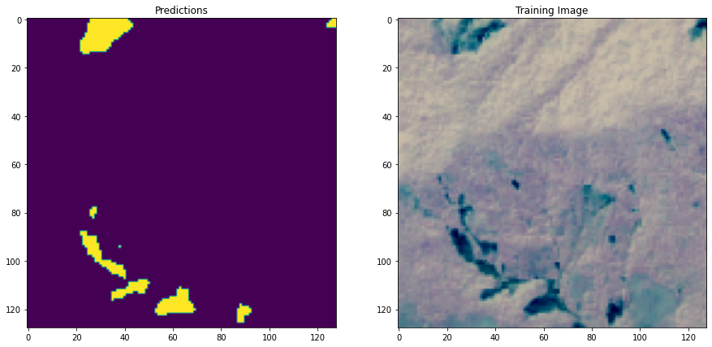
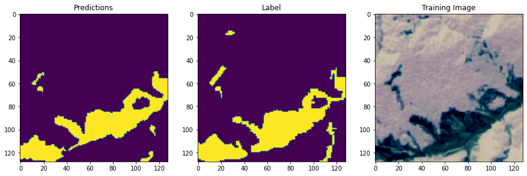

# Geospatial Landslide Detection Using Deep Learning
Assumption University - Senior Year Deep Learning Project

## Overview

This project focuses on detecting landslide events from multispectral Sentinel-2 satellite imagery using deep learning–based semantic segmentation.

A UNet convolutional neural network was implemented to perform pixel-wise binary classification of landslide versus non-landslide regions. The model integrates spectral and terrain-derived features including RGB bands, NDVI, slope, and elevation.

Below is an example of the final validation output showing predicted landslide regions:

The objective was to build a supervised segmentation pipeline capable of identifying landslide-affected regions from geospatial data in a reproducible deep learning workflow.

---

## Dataset

- Source: Sentinel-2 (Copernicus Program)
- 1600 labeled multispectral images
- Resolution: 128 × 128 pixels
- 14 spectral bands per image
- ~47,000 landslide and non-landslide patches
- Dataset reference: Landslide4Sense

Each sample includes:
- RGB channels
- Near-Infrared (NIR)
- Slope
- Elevation
- Binary segmentation mask

---

## Feature Engineering

### NDVI Calculation

The Normalized Difference Vegetation Index (NDVI) was computed as:

NDVI = (NIR - Red) / (NIR + Red)

NDVI enhances vegetation contrast and improves the identification of disturbed terrain typically associated with landslides.

### Final Model Input (6 Channels)

- Red  
- Green  
- Blue  
- NDVI  
- Slope  
- Elevation  

All channels were normalized prior to training.

Example RGB satellite input image:

---

## Model Architecture

- Architecture: UNet (Encoder–Decoder CNN)
- Framework: TensorFlow / Keras
- Input shape: (128, 128, 6)
- Output: Binary segmentation mask
- Loss Function: Binary Cross-Entropy
- Evaluation Metrics:
  - Accuracy
  - Precision
  - Recall
  - F1 Score

The skip connections in UNet preserve spatial resolution, enabling accurate pixel-level segmentation.

---

## Training Configuration

- Train/Validation split: 80/20
- Batch size: 16
- Epochs: 100
- Optimizer: Adam
- Model checkpointing based on validation F1 score

Final validation metrics:

- Accuracy: 0.989  
- F1 Score: 0.708  
- Precision: 0.793  
- Recall: 0.643  

Training curves across epochs:

---

## Pipeline Summary

1. Load multispectral Sentinel-2 imagery (.h5 format)
2. Normalize spectral and terrain features
3. Compute NDVI
4. Construct 6-channel feature tensor
5. Train UNet segmentation model
6. Evaluate using segmentation metrics
7. Generate binary landslide masks for unseen validation data

---

## Technologies Used

- Python  
- TensorFlow / Keras  
- NumPy  
- h5py  
- Matplotlib  
- Scikit-learn  

---
